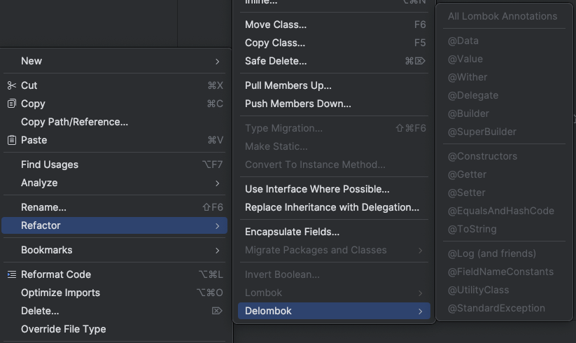

All essential lombok knowledge

---

docs: https://projectlombok.org/features/

---

Delombok

Replace all lombok annotations with actual implementation.



---

[val](https://projectlombok.org/features/val)

Will be replaced with exact value type. If value will be null than the type will be `Object`.

You can also find [var](https://projectlombok.org/features/var) that works similar, but use java's `var` since `Java 10`

```java
# with lombok
public class ValExample {
  public String example() {
    val example = new ArrayList<String>();
    example.add("Hello, World!");
    val foo = example.get(0);
    return foo.toLowerCase();
  }
}

# vanilla java
public class ValExample {
  public String example() {
    ArrayList<String> example = new ArrayList<String>();
    example.add("Hello, World!");
    String foo = example.get(0);
    return foo.toLowerCase();
  }
}

# config
lombok.val.flagUsage=[warning,error]
lombok.var.flagUsage=[warning,error]
# lombok will flag any usage of those as error or warning
# default - not set
```


[@NonNull](https://projectlombok.org/features/NonNull)

You can use on any param of method or constructor. Lombok will add null check at the top of the method. On primitive parameters will generate warnings.

```java
# with lombok
public class NonNullExample extends Something {
  private String name;
  
  public NonNullExample(@NonNull Person person) {
    super("Hello");
    this.name = person.getName();
  }
}

# vanilla java
public class NonNullExample extends Something {
  private String name;
  
  public NonNullExample(@NonNull Person person) {
    super("Hello");
    if (person == null) {
      throw new NullPointerException(
      "person is marked non-null but is null"
      );
    }
    this.name = person.getName();
  }
}

# config
lombok.nonNull.exceptionType=[NullPointerException, IllegalArgumentException,JDK,GUAVA,Assertion]
# which exception should be thrown / assert will be generated / JDK or Guava will instead of vanilla x == null will use functions from those frameworks
# default - NullPointerException

lombok.nonNull.flagUsage=[warning,error]
# if used than lombok will flag it as an error
# default - not set
```

[@Cleanup](https://projectlombok.org/features/Cleanup)

Will generate `try finally` block and call `.close()` in `finally` block. Also you can specify which method should be called f.e. `@Cleanup("thismethod")`.

```java
# with lombok
public class CleanupExample {
  public static void main(String[] args) throws IOException {
    @Cleanup InputStream in = new FileInputStream(args[0]);
    byte[] b = new byte[10000];
    while (true) {
      int r = in.read(b);
      if (r == -1) break;
    }
  }
}

# vanilla java
public class CleanupExample {
    public CleanupExample() {
    }

    public static void main(String[] args) throws IOException {
        InputStream in = new FileInputStream(args[0]);

        try {
            byte[] b = new byte[10000];

            int r;
            do {
                r = in.read(b);
            } while(r != -1);
        } finally {
            if (Collections.singletonList(in).get(0) != null) {
                in.close();
            }

        }

    }
}

# config
lombok.cleanup.flagUsage=[warning,error]
# lombok will flag any usage as waning/error
# default - not set
```


[@Getter and @Setter](https://projectlombok.org/features/GetterSetter)

You can put those annotations on class level or above class variable. Will generate getters and setters. You can specify accessLevel with `AccessLevel.` and set it to `PUBLIC, PROTECTED, PACKAGE, PRIVATE, NONE`. `NONE` means that getter/setter won't get generated. `@Getter` can be used on enums. Every generated method will be annotated with [@Generated](https://projectlombok.org/api/lombok/Generated)

`@Getter(lazy=true)` allows to create field that will store and cache method call (and also it will be thread safe). To accessed that value always use created by lombok getter.

```java
# with lombok
public class GetterSetterExample {
  @Getter @Setter private int age = 10;
  
  @Setter(AccessLevel.PROTECTED) private String name;

	@Getter(lazy=true) private final double[] cached = expensive();
  
  private double[] expensive() {
    double[] result = new double[1000000];
    for (int i = 0; i < result.length; i++) {
      result[i] = Math.asin(i);
    }
    return result;
  }
}

# vanilla java
public class GetterSetterExample {
	private int age = 10;
    private String name;
    private final AtomicReference<Object> cached = new AtomicReference();

    public GetterSetterExample() {
    }

    private double[] expensive() {
        double[] result = new double[1000000];

        for(int i = 0; i < result.length; ++i) {
            result[i] = Math.asin((double)i);
        }

        return result;
    }

    @Generated
    public int getAge() {
        return this.age;
    }

    @Generated
    public void setAge(int age) {
        this.age = age;
    }

    @Generated
    protected void setName(String name) {
        this.name = name;
    }

    @Generated
    public double[] getCached() {
        Object $value = this.cached.get();
        if ($value == null) {
            synchronized(this.cached) {
                $value = this.cached.get();
                if ($value == null) {
                    double[] actualValue = this.expensive();
                    $value = actualValue == null ? this.cached : actualValue;
                    this.cached.set($value);
                }
            }
        }

        return (double[])($value == this.cached ? null : $value);
    }
}

# config
lombok.accessors.chain =[true,false]
# default - false
# if set to true, than setters will return this

lombok.accessors.fluent=[true,false]
# default - false
# if set to true, than methods will not be prefixed with 'get', 'set', 'is', it will use just field names

lombok.accessors.prefix += [list]
lombok.accessors.prefix -= [list]
# will add or remove prefixes from all fields, f.e. if we do -= [meet]
and we will have field named meetName than getters and setters will look like 'getName' and 'setName'

lombok.getter.noIsPrefix=[true,false]
# default - false
# disables 'is' prefix for getters, will use 'get' instead

lombok.accessors.capitalization=[basic,beanspec]
# default - basic
# describeas how uShaped fields should be handled, f.e. iName
with 'basic' will look like 'getIName', but with beanspec will look like 'getiName'

lombok.setter.flagUsage=[warning,error]
lombok.getter.flagUsage=[warning,error]
lombok.getter.lazy.flagUsage=[warning,error]
# default - is no set
# will flag any usage of those as waning/error


```


[@ToString](https://projectlombok.org/features/ToString)

Will generate `.toString()` method.

By default all non-static methods will be included.

`@ToString.Exlude` to exclude fields
`@ToString.Include` to include fields

`@ToString(callSuper=true)` and `@ToString(`onlyExplicitlyIncluded=true) just like in `#config` section.

You can also include non-static methods that takes no arguments. Use `@ToString.Include` to accomplish that.

Change name of field with `@ToString.Include(name="new name")`.

Change the order of fields printed with `@ToString.Include(rank= 1)`. Higher number == printed first.

If we have method that has the same name as field and we will include that field than value of that field will be replaced with method call.

All fields that name starts with `$` will be by default excluded.

Can be used on enum.

```java
# with lombok
@ToString
public class ToStringExample {
  private static final int STATIC_VAR = 10;
  private String name;
  private Shape shape = new Square(5, 10);
  private String[] tags;
  @ToString.Exclude private int id;
  
  public String getName() {
    return this.name;
  }
  
  @ToString(callSuper=true, includeFieldNames=true)
  public static class Square extends Shape {
    private final int width, height;
    
    public Square(int width, int height) {
      this.width = width;
      this.height = height;
    }
  }
}

# vanilla java
public class ToStringExample {
	private static final int STATIC_VAR = 10;
    private String name;
    private Shape shape = new Square(5, 10);
    private String[] tags;
    private int id;

    public ToStringExample() {
    }

    public String getName() {
        return this.name;
    }

    @Generated
    public String toString() {
        String var10000 = this.getName();
        return "ToStringExample(name=" + var10000 + ", shape=" + String.valueOf(this.shape) + ", tags=" + Arrays.deepToString(this.tags) + ")";
    }

    public static class Square extends Shape {
        private final int width;
        private final int height;

        public Square(int width, int height) {
            this.width = width;
            this.height = height;
        }

        @Generated
        public String toString() {
            String var10000 = super.toString();
            return "ToStringExample.Square(super=" + var10000 + ", width=" + this.width + ", height=" + this.height + ")";
        }
    }
}

# config
lombok.toString.includeFieldNames=[true,false]
# default = true
# will skip fieldNames in printed text

lombok.toString.doNotUseGetters=[true,false]
# default = false
# if true, lombok will use fields directly and skip usage of getters

lombok.toString.callSuper=[call,skip.warn]
# default - skip
# call - will call superclass implementation of .toString()
# warn - will skip, but also will warn about that

lombok.toString.onlyExplicitlyIncluded=[true,false]
# default - false
# only fields with @ToString.Included will get included

lombok.toString.flagUsage=[warning,error]
# default - unset
# lombok will flah any usage
```


`@EqualsAndHashCode`

Generates `.equals()` and `.hashcode()`.

Similar to `@ToString`:
- `@EqualsAndHashCode.Exclude`
- `@EqualsAndHashCode.Include`
- `@EqualsAndHashCode(onlyExplicitlyIncluded = true)`

All static fields and [[transient]] fields will be skipped.

If method with the same name as variable exists than it will get skipped.

Variables that starts with `$` will be excluded automatically.

```java
# with lombok
@EqualsAndHashCode
public class EqualsAndHashCodeExample {
  private transient int transientVar = 10;
  private String name;
  private double score;
  
  @EqualsAndHashCode.Exclude
  private Shape shape = new Square(5, 10);
  
  private String[] tags;
  
  @EqualsAndHashCode.Exclude
  private int id;
  
  public String getName() {
    return this.name;
  }
}

# vanilla java
public class EqualsAndHashCodeExample {
    private transient int transientVar = 10;
    private String name;
    private double score;
    private Shape shape = new ToStringExample.Square(5, 10);
    private String[] tags;
    private int id;

    public EqualsAndHashCodeExample() {
    }

    public String getName() {
        return this.name;
    }

    @Generated
    public boolean equals(Object o) {
        if (o == this) {
            return true;
        } else if (!(o instanceof EqualsAndHashCodeExample)) {
            return false;
        } else {
            EqualsAndHashCodeExample other = (EqualsAndHashCodeExample)o;
            if (!other.canEqual(this)) {
                return false;
            } else if (Double.compare(this.score, other.score) != 0) {
                return false;
            } else {
                Object this$name = this.getName();
                Object other$name = other.getName();
                if (this$name == null) {
                    if (other$name != null) {
                        return false;
                    }
                } else if (!this$name.equals(other$name)) {
                    return false;
                }

                if (!Arrays.deepEquals(this.tags, other.tags)) {
                    return false;
                } else {
                    return true;
                }
            }
        }
    }

    @Generated
    protected boolean canEqual(Object other) {
        return other instanceof EqualsAndHashCodeExample;
    }

    @Generated
    public int hashCode() {
        int PRIME = 59;
        int result = 1;
        long $score = Double.doubleToLongBits(this.score);
        result = result * 59 + (int)($score >>> 32 ^ $score);
        Object $name = this.getName();
        result = result * 59 + ($name == null ? 43 : $name.hashCode());
        result = result * 59 + Arrays.deepHashCode(this.tags);
        return result;
    }
}

# config - 
lombok.equalsAndHashCode.doNotUseGetters=[true,false]
# default - false
# if set to true, than lombok won't use getters

lombok.equalsAndHashCode.callSuper=[call,skip,warn]
# default - warn
# use `.hashcode()` from parent class, skip it or warn on every usage on class that inherits something

lombok.equalsAndHashCode.flagUsage=[warning,error]
# default - not set
# flag any usage of this annotation
```


`@NoArgsConstructor, @RequiredArgsConstructor, @AllArgsConstructor`

Will generate constructors.

`@RequiredArgsConstructor` - will generate constructor for all `final` and `@NonNull` fields.

If we will write exactly the same constructor as lombok will generate than error will occur.

`@ConstructorProperties` - will be used for constructor with all fields.

`@NoArgsConstructor` will always set all non-set fields to default (0, false, null)/

`lombok.*<constructor>.flagUsage` won't get triggered for all `@Data` and `@Value`.

All of these annotations can be also used on enums. All constructors will be private (because enums cannot have public constructors).

```java
# with lombok
@RequiredArgsConstructor
@AllArgsConstructor(access = AccessLevel.PROTECTED)
public class ConstructorExample<T> {
  private int x, y;
  @NonNull private T description;
}

# vanilla java
public class ConstructorExample<T> {
    private int x;
    private int y;
    private @NonNull T description;

    @Generated
    public ConstructorExample(@NonNull T description) {
        if (description == null) {
            throw new NullPointerException("description is marked non-null but is null");
        } else {
            this.description = description;
        }
    }

    @Generated
    protected ConstructorExample(int x, int y, @NonNull T description) {
        if (description == null) {
            throw new NullPointerException("description is marked non-null but is null");
        } else {
            this.x = x;
            this.y = y;
            this.description = description;
        }
    }
}

# config
lombok.anyConstructor.addConstructorProperties=[true,false]
# default - false
# if set to true tan @ConstructorProperties will be used for all contructors

lombok.[allArgsConstructor|requiredArgsConstructor|noArgsConstructor|anyConstructor].flagUsage=[warning,error]
# default - not set
# if annotation used than show error

lombok.copyableAnnotations=[list]
# default - empty list
# if field has any annotations from list than they will be copied to constructor params, setter params and getter
# f.e. if field has @NonNull and @NonNull will be on the list than it will be copied from field into constructor param, setter param and getter method

lombok.noArgsConstructor.extraPrivate=[true,false]
# default - false
# if true, than lombok will generate private no-args constructor for all @Value or @Data class
```

